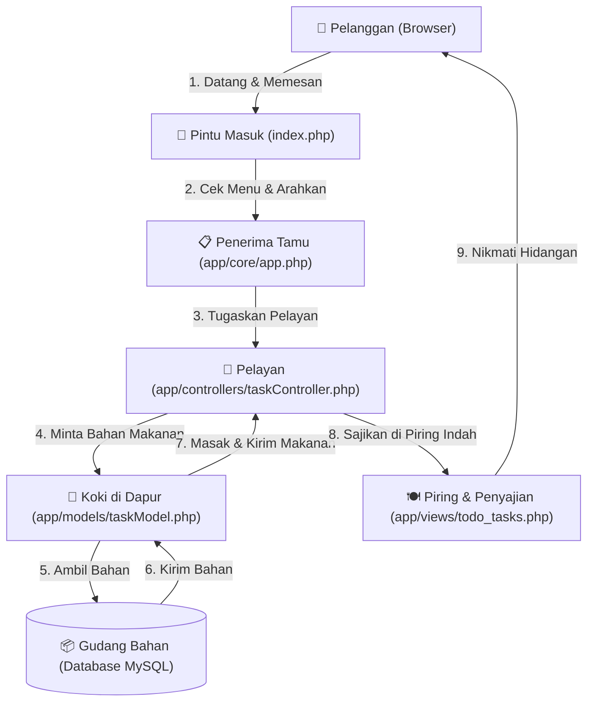

# Panduan Belajar PHP Native: Mengenal Struktur MVC Tanpa OOP

Selamat! Langkah Anda untuk mempelajari dasar-dasar (fundamentals) PHP Native sebelum terjun ke framework seperti Laravel adalah keputusan yang sangat tepat. Memahami alur kerja dasar sistem akan menghindarkan Anda dari fenomena *"magic"* (keajaiban framework) di mana kode berjalan begitu saja tanpa Anda tahu proses di belakang layar.

Dokumen ini akan menjelaskan **struktur folder** yang ada di proyek kita, memberikan **analogi nyata**, memetakan **alur request (routing)**, serta memberikan **langkah demi langkah (flow)** untuk membangun aplikasi To-Do List CRUD berbasis MVC prosedural/fungsional.

---

## 🏢 Analogi Nyata: Arsitektur Aplikasi sebagai "Restoran Bintang Lima"

Bayangkan aplikasi Anda adalah sebuah Restoran Bintang Lima. Pelanggan yang datang ingin memesan makanan, diproses di dapur, lalu disajikan kembali ke meja mereka. 

Berikut adalah pembagian peran folder dalam restoran kita:

---

## 📁 Penjelasan Teknis Struktur Folder

Mari kita bedah setiap folder di dalam workspace kita secara teknis beserta analoginya:

### 1. Root Directory (`/`)
* **File Utama**: `index.php`
* **Penjelasan Teknis**: Ini adalah *Front Controller* (Gerbang Utama). Semua request HTTP dari browser pelanggan akan masuk ke file ini terlebih dahulu. Tidak ada file lain yang diakses langsung oleh user di luar folder `public` dan file `index.php` ini.
* **Analogi**: **Pintu Masuk & Resepsionis Restoran**. Siapapun yang datang harus lewat pintu ini. Resepsionis akan menyambut tamu dan mengarahkan mereka.

### 2. `public/`
* **Isi**: Aset statis seperti CSS, Javascript, gambar (images), dan font.
* **Penjelasan Teknis**: Folder ini bersifat publik, artinya bisa diakses langsung oleh browser tanpa melalui proses PHP. Misalnya, `http://localhost/public/css/style.css`.
* **Analogi**: **Halaman Parkir & Dekorasi Luar Restoran**. Siapapun bisa melihat papan nama restoran, taman, dan lampu hias dari luar tanpa perlu memesan makanan atau masuk ke dalam restoran.

### 3. `app/`
Ini adalah "Jantung" dari aplikasi kita. Di dalamnya terdapat seluruh logika dan struktur utama.

#### a. `app/config/`
* **File Utama**: `database.php`
* **Penjelasan Teknis**: Menyimpan konfigurasi global seperti detail koneksi database (Host, Username, Password, Nama Database). File ini biasanya mengembalikan objek koneksi PDO (PHP Data Objects).
* **Analogi**: **Kunci & Peta Gudang Bahan Makanan**. Menyimpan alamat pemasok bahan makanan, password gembok gudang, serta prosedur keselamatan untuk masuk ke gudang.

#### b. `app/core/`
* **File Utama**: `app.php`
* **Penjelasan Teknis**: Mengatur alur utama aplikasi, terutama sistem **Routing** (mengarahkan URL ke controller yang tepat). Core ini memproses URL yang diminta user (misalnya `index.php?page=task&action=create`) dan memanggil fungsi yang sesuai.
* **Analogi**: **Manajer Penerima Tamu**. Dia yang mencatat pesanan awal, melihat menu, lalu berteriak memanggil Pelayan (Controller) mana yang bertugas melayani pesanan spesifik tersebut.

#### c. `app/controllers/` (C - Controllers)
* **File Utama**: `taskController.php`
* **Penjelasan Teknis**: Otak dari alur aplikasi. Controller bertugas menerima input dari user (lewat parameter URL atau form POST), memanggil fungsi di Model untuk memproses data, lalu memuat file View yang sesuai untuk ditampilkan kembali ke user.
* **Analogi**: **Pelayan Restoran (Waiter)**. Pelayan tidak memasak makanan (itu tugas Model) dan tidak membuat piring sendiri (itu tugas View). Pelayan mencatat pesanan Anda, memberikannya ke dapur, mengambil makanan yang sudah jadi, lalu menaruhnya di piring saji untuk diletakkan di meja Anda.

#### d. `app/models/` (M - Models)
* **File Utama**: `taskModel.php`
* **Penjelasan Teknis**: Berurusan langsung dengan data dan database. Di sinilah query SQL ditulis (`SELECT`, `INSERT`, `UPDATE`, `DELETE`). Model mengambil data mentah dari database, memprosesnya, dan mengembalikannya ke Controller dalam format array/data siap pakai.
* **Analogi**: **Koki di Dapur**. Koki tahu cara mengambil bahan di gudang, memotong daging, memasak bumbu rahasia, dan memproses bahan mentah menjadi hidangan yang lezat. Koki tidak peduli siapa tamunya atau piring apa yang dipakai, dia hanya fokus memasak pesanan yang diminta oleh Pelayan.

#### e. `app/views/` (V - Views)
* **File Utama**: `todo_tasks.php`
* **Penjelasan Teknis**: Bagian tampilan (User Interface). Hanya berisi kode HTML, CSS, dan sedikit kode PHP (`foreach`, `echo`, `if`) untuk menampilkan data yang dikirim dari Controller. View tidak boleh melakukan query database langsung!
* **Analogi**: **Piring & Estetika Penyajian Makanan**. Bagaimana makanan dihias, diletakkan di piring cantik, diberi garnish, agar tampak lezat dan menggugah selera pelanggan saat ditaruh di meja.

---

## 🗺️ Alur & Langkah Kerja Pembuatan Aplikasi (Roadmap)

Untuk membuat aplikasi To-Do List berbasis MVC prosedural yang rapi dan aman, berikut adalah urutan pengerjaan yang direkomendasikan dari awal sampai akhir:

### 🛠️ Langkah 1: Persiapan Database
1. Membuat database baru di MySQL (misal: `todolist_native`).
2. Membuat tabel `tasks` dengan kolom:
   * `id` (INT, Primary Key, Auto Increment)
   * `title` (VARCHAR 255, nama tugas)
   * `status` (TINYINT / ENUM, status selesai/belum: `0` untuk belum, `1` untuk selesai)
   * `created_at` (TIMESTAMP, waktu dibuat)

### 🔌 Langkah 2: Setup Koneksi Database (`app/config/database.php`)
1. Mengaktifkan koneksi menggunakan **PDO** (PHP Data Objects) karena ini adalah standar modern PHP yang aman dan fleksibel.
2. Menggunakan `try-catch` block untuk menangani error koneksi agar tidak menampilkan informasi kredensial database yang sensitif jika koneksi gagal.

### 🔀 Langkah 3: Setup Router / Front Controller (`index.php` & `app/core/app.php`)
1. Mengatur `index.php` untuk memuat (require) file-file penting: konfigurasi database, model, controller, dan router core.
2. Di dalam `app/core/app.php`, kita buat sistem routing prosedural sederhana berbasis parameter `$_GET` (misalnya: `index.php?action=add`). Router akan mendeteksi parameter ini lalu memanggil fungsi controller yang tepat.

### 🍳 Langkah 4: Membuat Data Handler / Model (`app/models/taskModel.php`)
Kita buat fungsi-fungsi manipulasi data (CRUD) menggunakan koneksi `$pdo` yang dikirim dari controller:
* `db_get_all_tasks($pdo)` -> Mengambil semua tugas (READ)
* `db_add_task($pdo, $title)` -> Menambahkan tugas baru (CREATE)
* `db_toggle_task($pdo, $id)` -> Mengubah status selesai/belum selesai (UPDATE)
* `db_delete_task($pdo, $id)` -> Menghapus tugas (DELETE)
* **PENTING**: Kita akan menggunakan **Prepared Statements** (`$pdo->prepare()`) untuk menghindari celah keamanan **SQL Injection**.

### 💁 Langkah 5: Membuat Pengendali Logika / Controller (`app/controllers/taskController.php`)
Kita buat fungsi-fungsi controller yang menghubungkan aksi user dengan Model dan View:
* `task_index_controller($pdo)` -> Mengambil data tugas via model, lalu me-load view `todo_tasks.php` dengan mengirim data tugas tersebut.
* `task_add_controller($pdo)` -> Menerima input form `title`, memanggil model tambah tugas, lalu me-redirect halaman kembali ke halaman utama.
* `task_toggle_controller($pdo)` -> Mengubah status tugas berdasarkan ID dari URL, lalu me-redirect.
* `task_delete_controller($pdo)` -> Menghapus tugas berdasarkan ID dari URL, lalu me-redirect.

### 🍽️ Langkah 6: Membuat Tampilan Premium / View (`app/views/todo_tasks.php`)
1. Membuat layout HTML5 yang premium dan responsif dengan CSS vanila yang memukau (warna modern, efek glassmorphism, transisi halus, dark mode/sleek interface).
2. Menampilkan daftar tugas menggunakan looping `foreach`.
3. Menyediakan form input teks dengan tombol "Tambah Tugas".
4. Menambahkan tombol ikon centang (untuk toggle status) dan tombol tempat sampah (untuk hapus) yang langsung mengarah ke URL routing kita (misal: `index.php?action=toggle&id=X`).

---

**Mengapa Menggunakan MVC Tanpa OOP (Prosedural)?**
OOP (Object-Oriented Programming) menambahkan lapisan kompleksitas seperti `class`, `$this`, `namespace`, `public/private/protected`, dan `inheritance`. Dengan memulai lewat fungsi prosedural biasa yang diorganisasi ke dalam folder MVC, Anda akan memahami **esensi pembagian tugas** (Separation of Concerns) secara murni terlebih dahulu. Setelah Anda mahir memisahkan alur kode dengan fungsi biasa, transisi ke OOP akan terasa sangat alami dan mudah dipahami!
